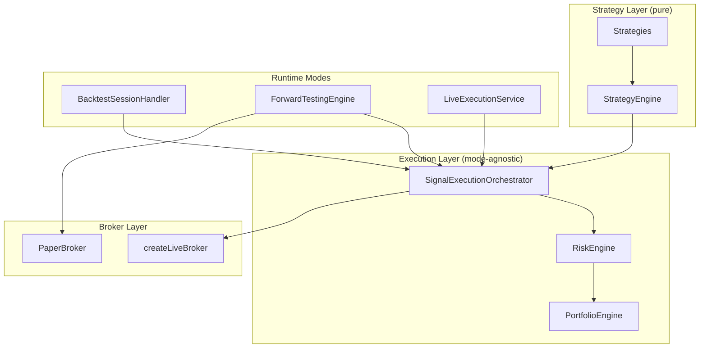

# Zingmeric (AlgoTrader) — Principal Engineer & Quant Developer Review

**Review date:** 2025-06-14  
**Version:** 0.1.0  
**Scope:** Full codebase (`src/`, `tests/`, `prisma/`, CI, infra)  
**Tests at review:** 284 passing, 2 skipped (61 suites)  
**Reviewer lens:** Architecture, performance, trading correctness, risk controls, observability, testing

---

## Executive Summary

Zingmeric is a well-structured Phase 1 quantitative trading platform with a **strong unified backtest pipeline** (event replay → strategy signals → generic execution → portfolio/risk → metrics). Module boundaries, dependency injection via factories, and broad test coverage (~88% lines, ~69% branches) reflect good engineering discipline.

However, several **trading-correctness defects** can produce silently wrong backtest results: strategy internal state is mutated before execution confirmation, covered-call equity closes use the wrong position ID, defined-risk fees are not deducted from portfolio cash, and backtest risk defaults effectively disable production risk rules. The **live execution path is incomplete** — multi-leg spread orchestration does not exist, and forward/paper paths skip `RiskEngine` entirely.

The primary architectural debt is **parallel legacy and modern implementations** (three backtest paths, three portfolio trackers, duplicate execution services) plus **schema/API disconnect** (Prisma models and read-only analytics API exist, but the unified engine never persists results).

| Dimension | Score | Summary |
|-----------|------:|---------|
| **Architecture** | **7.0 / 10** | Unified event pipeline is sound; dual stacks, layer violations, missing composition root |
| **Trading Correctness** | **5.5 / 10** | State desync bugs, optimistic fills, same-bar look-ahead, incomplete expiry handling |
| **Risk Controls** | **5.0 / 10** | Risk engine exists but bypassed in backtest defaults, forward test, and live paths |
| **Performance** | **7.0 / 10** | Sync in-memory backtest is fine for Phase 1; N+1 in analytics API, memory-heavy replay |
| **Observability** | **6.0 / 10** | OTel + Prometheus scaffolded; dead event-bus metrics path, silent risk rejections |
| **Testing** | **7.5 / 10** | Strong unit coverage; gaps in execution layer, session handler, Prisma integration |
| **Production Readiness** | **4.5 / 10** | No live spread orchestration, no backtest persistence, no API auth, jobs stub |

---

## Architecture

### Strengths

1. **Strategy-agnostic execution model** — Strategies emit `Signal.execution` payloads (`OPEN_DEFINED_RISK`, `CLOSE_DEFINED_RISK`, `OPEN_EQUITY`, `COMPOSITE`). The engine executes generically without strategy-specific branches in the core loop.
   - `src/backtest/execution/backtest-execution.service.ts`
   - `src/strategies/types/signal-execution.type.ts`

2. **Unified backtest pipeline** is documented and testable:
   ```
   HistoricalDataLoader → ReplayEngine → EventBus
     → BacktestSessionHandler → StrategyEngine → BacktestExecutionService
     → PortfolioEngine + RiskEngine → MetricsEngine
   ```
   - `src/backtest/engine/README.md`
   - `src/backtest/engine/unified-backtest.engine.ts`

3. **Broker abstraction** — Common `Broker` interface, `LiveBrokerAdapter` with retry, `createLiveBroker()` factory. Strategy layer can depend on `Broker` without knowing Zerodha/Upstox.
   - `src/broker/broker.interface.ts`
   - `src/broker/live/live-broker.factory.ts`

4. **Interface-first persistence** — Repository interfaces with Prisma and in-memory implementations (analytics, market-data, equity snapshots).

5. **Manual DI via factories** — `createUnifiedBacktestEngine(deps)`, injectable route deps, test-friendly mocks throughout.

### Weaknesses

| Issue | Location | Impact |
|-------|----------|--------|
| Three backtest execution paths | `UnifiedBacktestEngine`, `CandleBacktestEngine`, inline `*-backtest.runner.ts` | Inconsistent metrics, trades, and risk behavior per strategy |
| Three portfolio systems | `portfolio-engine.ts`, `portfolio-tracker.ts`, `portfolio-simulator.ts` | PnL/margin source-of-truth confusion |
| Duplicate execution services | `BacktestExecutionService`, `ForwardSignalExecutionService` | Divergent behavior when fixing bugs |
| Layer violations | `StrategyEngine` → `BacktestMetricsPublisher`; `PaperBroker` → `backtest/simulation/trading-costs.ts` | Circular coupling, harder extraction |
| Broken barrel import | `src/backtest/index.ts:1` | `../../src/strategies/...` escapes `rootDir` |
| Schema without write path | `prisma/schema.prisma` + analytics API | DB models unused by unified engine |
| No composition root | Wiring scattered across routes, pipelines, examples | Hard to bootstrap production |

### Recommended Target Architecture



**Refactoring:** Extract `SignalExecutionOrchestrator` from `BacktestExecutionService` and `ForwardSignalExecutionService`. Move `TradingCostConfig` to `src/execution/costs/`. Introduce `src/app/bootstrap.ts` as the single composition root.

---

## Performance

### Hot Paths

| Component | File | Concern |
|-----------|------|---------|
| Replay loop | `src/backtest/engine/replay-engine.ts` | O(n) sync `publish` per event; returns full `events[]` |
| Session handler | `src/backtest/engine/backtest-session.handler.ts` | Per bar: strategy + execution + dual MTM passes |
| Event merge | `src/backtest/engine/historical-data-loader.service.ts` | `[...merged].sort()` — full copy before replay |
| Portfolio snapshot | `src/portfolio/engine/portfolio-engine.ts` | Recomputes margin + unrealized on every `snapshot` access |
| Strategy eval | `src/strategies/engine/strategy-engine.ts` | OTel span per bar |

Backtest is intentionally **single-threaded and synchronous** — correct for determinism. Parallelize at the **job** level (BullMQ), not inside the per-event loop.

### Database (Non-Hot Path)

| Issue | File | Recommendation |
|-------|------|----------------|
| **N+1 on list** | `src/analytics/service/backtest-analytics.service.ts:32–43` | `listBacktests` calls `loadContext(run.id)` per item → 4 queries × N |
| Load-all-then-filter ATM | `src/market-data/repository/prisma-option-chain.repository.ts` | Fetch all chain rows, select ATM in JS |
| Duplicate run fetch | `backtest-analytics.service.ts:116` | `loadContext` re-fetches run already held by caller |

### Memory

- All candles/chains materialized as events upfront; sorted copy doubles peak memory.
- Equity curve grows O(bars); option chain objects embedded per snapshot.
- No streaming/generator replay for multi-year runs.

**Recommendations:**
1. Iterator-based replay; make `events[]` in result optional.
2. Single MTM pass in `backtest-session.handler.ts`.
3. Push ATM strike selection to SQL (`ORDER BY ABS(strikePrice - $price) LIMIT n`).
4. Add benchmark test: 10k bars, assert memory/time bounds.

---

## Trading Correctness

### Execution Flow (Current)

```
MarketSnapshot → Strategy.evaluate() → Signal + execution payload
  → BacktestExecutionService.executeSignal()
  → RiskEngine.validateNewTrade() [may silently return]
  → PortfolioEngine.open/close
```

### Verified Defects

#### 1. Strategy state mutated before execution confirmation

All strategies set/clear internal `position` **before** the portfolio confirms the trade.

**Bull Put V1 open** — `src/strategies/spreads/bull-put-spread-v1.strategy.ts:94–112`:
```typescript
this.position = { entryTimestamp, entryCredit, shortStrike, ... };
return createSignal({ execution: this.createOpenExecution(...) });
```

**Bull Put V1 close** — same file, lines 175–176:
```typescript
private close(...) {
  this.position = null;  // cleared before portfolio close
  return createSignal({ execution: { kind: 'CLOSE_DEFINED_RISK', closeCost } });
}
```

If `RiskEngine` blocks the open (`backtest-execution.service.ts:102–105` silent `return`), or `PortfolioEngine` throws on margin, strategy believes it has a position while portfolio does not.

**Same pattern in:**
- `src/strategies/spreads/bull-put-spread.strategy.ts`
- `src/strategies/spreads/iron-condor.strategy.ts`
- `src/strategies/equity/covered-call.strategy.ts`

**Fix:** Strategies must be **pure functions of snapshot + prior confirmed state**. Move position tracking to `PortfolioEngine` or a `StrategyStateStore` updated only after successful execution. Return `Signal` without mutating `this.position`; let execution layer call `strategy.onExecutionConfirmed(event)`.

#### 2. Covered call equity close — position ID mismatch

Equity positions use `createPositionId(strategy, instrumentId)` → `covered-call:inst-id:default` (`portfolio.types.ts:115–118`).

Close signal uses wrong ID — `src/strategies/equity/covered-call.strategy.ts:141–143`:
```typescript
positionId: `${this.name}:${snapshot.instrumentId}`,  // missing ':default'
```

`closeEquity` silently returns when position not found (`backtest-execution.service.ts:218–222`). Stock leg never closes.

**Fix:** Use `createPositionId(this.name, snapshot.instrumentId)` or add `legGroupId: 'default'` to close step.

#### 3. Composite execution has no rollback

Covered call opens stock then short call sequentially (`covered-call.strategy.ts:69–87`). If step 1 succeeds and step 2 fails (margin/risk), portfolio holds **unhedged long stock**.

**Fix:** Wrap composite steps in a transaction-like unit with compensating closes on failure, or validate all legs upfront before executing any.

#### 4. Defined-risk fees not applied to portfolio cash

`openDefinedRisk` computes fees and records to trade ledger but never passes fees to `PortfolioEngine`:

`src/backtest/execution/backtest-execution.service.ts:107–133`:
```typescript
const fees = this.calculateFees('SELL', step.entryCredit, quantity);
const position = this.portfolioEngine.openDefinedRiskPosition({ ... }); // no fees
this.tradeLedger.record({ totalFees: fees.totalFees, ... });             // ledger only
```

Equity paths correctly pass `fees: fees.totalFees` (lines 196, 231). Backtest equity is **overstated** for spread strategies when `includeCosts: true`.

**Fix:** Deduct `fees.totalFees` from cash in `openDefinedRiskPosition` / `closeDefinedRiskPosition`, mirroring equity path.

#### 5. Paper broker zero-cost defined-risk fills

`src/broker/paper/paper-broker.ts:257`:
```typescript
return this.createFill(order, request, timestamp, this.zeroCosts(request.price), 0);
```

Forward test PnL diverges from backtest when costs enabled.

**Fix:** Route through `calculateOrderCosts()` when `includeCosts: true`.

#### 6. Same-bar look-ahead

`BacktestSessionHandler` pairs MARKET + OPTION_CHAIN at **exact same timestamp**, evaluates strategy on bar close with same-bar chain (`backtest-session.handler.ts:62–83`). Spread credit uses mid quotes; fill assumed at close. Optimistic vs live execution.

**Fix (Phase 2):** Execute on next bar open, or use previous bar chain for signal and current bar for fill with explicit slippage model. Document assumption in backtest config.

#### 7. Expiry handling incomplete

| Strategy | Expiry exit |
|----------|-------------|
| Bull Put V1 | Yes — day-level UTC comparison |
| Bull Put v0, Iron Condor, Covered Call | **No** |

V1 expiry settlement: if chain quotes missing, `closeCost ?? 0` assumes max profit (`bull-put-spread-v1.strategy.ts:124–130`).

**Fix:** Implement intrinsic-value settlement at expiry for all spread strategies. Fail closed (do not assume zero debit) when chain data missing.

#### 8. No partial fills

All fills are full-quantity, immediate. Limit orders in paper broker fill entirely when price touched. Live brokers return `fill: null` until manual `recordFill()`.

**Fix:** Document as Phase 1 assumption. Add `PartialFill` model before live trading.

#### 9. Legacy candle engine ignores execution payload

`CandleBacktestEngine` + `DefaultOrderSimulator` ignore `signal.execution`. Only BUY/SELL on candle close. Spread strategies run through this path produce wrong results.

**Fix:** Deprecate `CandleBacktestEngine` for options strategies; route all spread backtests through `UnifiedBacktestEngine`.

---

## Risk Controls

### What Exists

`src/risk/engine/risk-engine.ts`:
- Per-trade soft limit: `maxRiskPerTradePct` (default 1%)
- Per-trade hard stop: `hardStopRiskPerTradePct` (default 2%)
- Portfolio drawdown block at `maxPortfolioDrawdownPct` (default 15%)

Wired **only** in `BacktestExecutionService`. Not in forward test, paper broker, or live brokers.

### Gaps vs `rules.md`

| Rule (`rules.md`) | Status |
|-------------------|--------|
| 1% account risk per trade | Implemented in `RiskEngine`; **disabled in backtest defaults** |
| 2% hard limit — reject trade | Implemented |
| 10% drawdown → reduce size 50% | **Not implemented** |
| 15% drawdown → stop new trades | Implemented (blocks at ≥15%) |
| Max concurrent positions | **Not implemented** |
| Margin checks in risk layer | Only in `PortfolioEngine`, not `RiskEngine` |
| Naked short prevention | Strategy-level only (covered call strike > spot) |

### Backtest Risk Defaults Disable Enforcement

`src/backtest/engine/backtest-engine.types.ts:28–33`:
```typescript
export const BACKTEST_RISK_CONFIG: RiskEngineConfig = {
  maxRiskPerTradePct: 0.99,
  hardStopRiskPerTradePct: 1,
  maxPortfolioDrawdownPct: 1,
};
```

Historical replays **never enforce** production 1%/2%/15% rules unless `config.riskConfig` is explicitly overridden.

**Fix:** Split configs: `PRODUCTION_RISK_CONFIG` (1%/2%/15%) and `PERMISSIVE_BACKTEST_RISK_CONFIG` with explicit opt-in. Default unified engine examples to production config; use permissive only in unit tests.

### Silent Risk Rejection

`backtest-execution.service.ts:102–105`:
```typescript
if (!validation.allowed) {
  return;  // no log, no metric, strategy already mutated
}
```

**Fix:** Emit `strategy_risk_rejected_total` metric, log violations, and notify strategy via `onExecutionRejected` callback.

### Live Path Blocks Spreads Without Orchestration

`src/broker/zerodha/zerodha-broker.ts:149–153` and `src/broker/upstox/upstox-broker.ts` reject `definedRisk` orders. No multi-leg orchestration service exists.

**Fix:** Implement `SpreadExecutionOrchestrator` that decomposes aggregate spread into individual broker orders with rollback/compensation logic.

---

## Observability

### What Exists

| Layer | Files | Status |
|-------|-------|--------|
| OTel bootstrap | `src/observability/register.ts`, `instrumentation.ts` | Pre-loaded via `--import` |
| Tracing | `tracing/tracing.service.ts` | Spans: `backtest.run`, `strategy.evaluate`, `backtest.replay` |
| Prometheus | `metrics/metric-definitions.ts`, `prometheus-metrics.middleware.ts` | 8 business metrics on app port |
| Fastify OTel | `api/server.ts` | `@fastify/otel` when enabled |
| Test disable | `tests/setup/otel-disable.ts` | Clean test runs |

### Gaps

| Gap | Detail |
|-----|--------|
| **Dead event-bus metrics path** | `BacktestMetricsPublisher` listens for `ORDER_FILLED`, `POSITION_OPENED` events, but unified path **never publishes them** — only MARKET/OPTION_CHAIN from loader |
| **Silent risk rejections** | No metric or structured log when trades blocked |
| **No structured logging** | Fastify logger + `console.error` only; no trace ID correlation |
| **No global error handler** | No Fastify `setErrorHandler` with OTel exception recording |
| **Forward test metrics orphaned** | `ForwardTestMetricsCollector` not wired to Prometheus |
| **METRICS_PORT mismatch** | Config mentions separate port; metrics served on `:3000/metrics` |
| **Live broker PnL stub** | `ZerodhaBroker.getPnlSummary()` returns `equity: 0, cash: 0` |

**Fix for dead metrics:** Either publish execution events from `BacktestExecutionService` after each fill, or remove bus subscription and call `metricsService.recordOrderExecuted()` directly (document chosen path in `backtest/observability/README.md`).

---

## Testing

### Current State

- **284 tests passing**, 61 suites, ~88% line / ~69% branch coverage
- Jest threshold: 50% global (below `rules.md` 80% target)
- Strong unit tests: strategies, portfolio, risk, broker, backtest components
- Limited integration: health, paper-broker, zerodha retry

### Critical Coverage Gaps

| Module | Path | Missing Tests |
|--------|------|---------------|
| Backtest execution | `src/backtest/execution/backtest-execution.service.ts` | Risk rejection, defined-risk fees, composite rollback, silent close |
| Session handler | `src/backtest/engine/backtest-session.handler.ts` | MTM, option-chain pairing, timestamp mismatch |
| Position marking | `src/backtest/execution/position-mark.resolver.ts` | BULL_PUT, IRON_CONDOR, COVERED_CALL mark prices |
| Covered call strategy | `src/strategies/equity/covered-call.strategy.ts` | Close position ID bug |
| Report export | `src/backtest/report/backtest-report.export.ts` | CSV/JSON round-trip |
| Prisma repos | `src/analytics/repository/prisma-*.ts` | Only in-memory repos tested |
| Live broker adapter | `src/broker/live/live-broker.adapter.ts` | Retry integration beyond Zerodha |

### Missing Trading Scenario Tests

1. Risk engine blocks trade → strategy state remains flat (currently would fail — exposes bug #1)
2. Covered call full lifecycle → equity leg closes on exit
3. Composite failure → no orphaned stock position
4. Expiry settlement with missing chain → should not assume zero debit
5. Drawdown halt mid-backtest → no new trades after 15%
6. `BACKTEST_RISK_CONFIG` vs production config → different rejection behavior
7. Costs enabled: backtest vs paper broker PnL parity
8. 10k+ bar replay benchmark (memory/time regression)

**Recommendation:** Raise Jest branch threshold to 75%. Add `tests/backtest/backtest-execution.service.test.ts` as highest priority.

---

## Critical Issues

> Defects that can produce **wrong PnL, wrong positions, or silent data loss**. Fix before trusting backtest results or moving toward live trading.

### C-1: Strategy/portfolio state desync

**Impact:** Strategy and portfolio disagree on open positions. Subsequent entries/exits fire on wrong state. Backtest metrics unreliable.

**Location:**
- `src/strategies/spreads/bull-put-spread-v1.strategy.ts:94–112, 175–176`
- `src/strategies/spreads/bull-put-spread.strategy.ts`
- `src/strategies/spreads/iron-condor.strategy.ts`
- `src/strategies/equity/covered-call.strategy.ts`

**Recommendation:**
```typescript
// BEFORE (wrong): mutate in evaluate()
this.position = { ... };
return createSignal({ execution: openStep });

// AFTER: pure evaluate, confirm in handler
evaluate(snapshot): Signal {
  if (shouldOpen(snapshot)) {
    return createSignal({ execution: openStep, intent: 'OPEN' });
  }
}
// BacktestExecutionService after successful open:
strategyContext.confirmOpen(positionId, metadata);
```

Extract `StrategyContext` port injected into strategies for read-only position queries from portfolio, not local mutable state.

---

### C-2: Covered call equity close never executes

**Impact:** Stock leg remains open after strategy emits close. Portfolio drifts from strategy belief.

**Location:** `src/strategies/equity/covered-call.strategy.ts:141–143`

**Recommendation:**
```typescript
import { createPositionId } from '../../portfolio/types/portfolio.types.js';

// Replace:
positionId: `${this.name}:${snapshot.instrumentId}`,
// With:
positionId: createPositionId(this.name, snapshot.instrumentId),
```

Add test in `tests/strategies/equity/covered-call.strategy.test.ts` asserting close step positionId matches open.

---

### C-3: Defined-risk fees not deducted from portfolio cash

**Impact:** Overstated equity and risk capacity in backtests with `includeCosts: true`.

**Location:** `src/backtest/execution/backtest-execution.service.ts:107–133`

**Recommendation:**
```typescript
const position = this.portfolioEngine.openDefinedRiskPosition({
  ...existingParams,
  fees: fees.totalFees,  // add to PortfolioEngine API
});
```
Mirror in `closeDefinedRisk` for exit fees. Add assertion: `portfolio.cash` decreases by fees after spread open.

---

### C-4: Backtest risk defaults disable production rules

**Impact:** Backtests do not represent live risk behavior. False confidence in strategy performance.

**Location:** `src/backtest/engine/backtest-engine.types.ts:28–33`

**Recommendation:**
```typescript
export const PRODUCTION_RISK_CONFIG: RiskEngineConfig = {
  maxRiskPerTradePct: 0.01,
  hardStopRiskPerTradePct: 0.02,
  maxPortfolioDrawdownPct: 0.15,
};

// Use PRODUCTION_RISK_CONFIG as unified engine default.
// Export PERMISSIVE_BACKTEST_RISK_CONFIG only for tests needing unconstrained replay.
```

Update `examples/` and pipeline wrappers to use production config explicitly.

---

### C-5: No live multi-leg spread orchestration

**Impact:** Cannot execute defined-risk strategies live. Brokers reject aggregate spread orders.

**Location:**
- `src/broker/zerodha/zerodha-broker.ts:149–153`
- `src/broker/upstox/upstox-broker.ts` (same pattern)

**Recommendation:** Create `src/execution/spread-execution-orchestrator.ts`:
```typescript
interface SpreadExecutionOrchestrator {
  openSpread(legs: SpreadLeg[], context: ExecutionContext): Promise<SpreadOpenResult>;
  closeSpread(positionId: string, context: ExecutionContext): Promise<SpreadCloseResult>;
}
```
Orchestrator places individual legs via `Broker`, tracks leg-group state, implements rollback on partial failure. Wire into forward test before live.

---

## High Priority Issues

### H-1: Composite execution lacks rollback

**Impact:** Unhedged stock on partial composite failure (covered call).

**Location:** `src/strategies/equity/covered-call.strategy.ts:69–87`, `backtest-execution.service.ts` COMPOSITE handler

**Recommendation:** In orchestrator, execute steps atomically:
```typescript
const executed: ExecutedStep[] = [];
try {
  for (const step of composite.steps) {
    executed.push(await this.executeStep(step));
  }
} catch (error) {
  for (const step of executed.reverse()) {
    await this.compensate(step);
  }
  throw error;
}
```

---

### H-2: RiskEngine absent from forward test and paper broker

**Impact:** Forward test and paper trading bypass all pre-trade validation.

**Location:** `src/forward-test/execution/forward-signal-execution.service.ts` (no RiskEngine import)

**Recommendation:** Inject `RiskEngine` into `ForwardSignalExecutionService` mirroring backtest path. Reject orders before `PaperBroker.placeOrder()`.

---

### H-3: Silent risk rejection with no observability

**Impact:** Trades silently dropped; impossible to debug backtest behavior.

**Location:** `src/backtest/execution/backtest-execution.service.ts:102–105`

**Recommendation:**
```typescript
if (!validation.allowed) {
  this.metricsService.increment('strategy_risk_rejected_total', {
    strategy: signal.strategyName,
    reason: validation.violations[0]?.rule,
  });
  this.logger.warn({ violations: validation.violations, signal }, 'Trade rejected by risk engine');
  return;
}
```

---

### H-4: Duplicate execution services will diverge

**Impact:** Bug fixes applied to backtest but not forward test (or vice versa).

**Location:**
- `src/backtest/execution/backtest-execution.service.ts`
- `src/forward-test/execution/forward-signal-execution.service.ts`

**Recommendation:** Extract shared `SignalExecutionOrchestrator` used by both. Mode-specific adapters only for fill simulation vs broker placement.

---

### H-5: Backtest results not persisted to database

**Impact:** Analytics API (`GET /analytics/backtests`) returns empty unless manually seeded. Schema investment unused.

**Location:** `src/backtest/engine/unified-backtest.engine.ts`, `src/analytics/service/backtest-analytics.service.ts`

**Recommendation:** Create `BacktestRunPersistenceService`:
```typescript
async persistRun(report: BacktestReport, config: BacktestEngineConfig): Promise<string> {
  // prisma.backtestRun.create + trades + equitySnapshots + positions
}
```
Call at end of `UnifiedBacktestEngine.run()`. Add integration test: run engine → query API → verify metrics match.

---

### H-6: N+1 query in listBacktests

**Impact:** API latency scales linearly with number of backtest runs. Production failure under load.

**Location:** `src/analytics/service/backtest-analytics.service.ts:32–43`

**Recommendation:**
```typescript
// Replace per-item loadContext with batch load:
const runIds = result.items.map(r => r.id);
const contexts = await this.repository.loadContextsBatch(runIds);
// Or: add summary metrics columns to BacktestRun table at persist time
```

---

### H-7: Three parallel backtest paths

**Impact:** Iron condor / bull put v0 may use legacy candle engine without option chains or risk.

**Location:**
- `src/backtest/engine/candle-backtest.engine.ts`
- `src/strategies/spreads/*-backtest.runner.ts`
- `src/backtest/pipeline/bull-put-spread-backtest.pipeline.ts`

**Recommendation:** Deprecation plan:
1. Mark `CandleBacktestEngine` `@deprecated` for options.
2. Migrate all `*-backtest.runner.ts` to call `UnifiedBacktestEngine`.
3. Remove `PortfolioTracker` / `PortfolioSimulator` once migration complete.

---

## Medium Priority Issues

### M-1: Same-bar look-ahead in execution model

**Impact:** Optimistic backtest results vs live.

**Location:** `src/backtest/engine/backtest-session.handler.ts:62–83`

**Recommendation:** Add `executionTiming: 'SAME_BAR_CLOSE' | 'NEXT_BAR_OPEN'` to `BacktestEngineConfig`. Default to `SAME_BAR_CLOSE` with documented assumption. Implement `NEXT_BAR_OPEN` for conservative mode.

---

### M-2: Expiry handling missing for 3 of 4 strategies

**Impact:** Positions never close at expiry in iron condor, bull put v0, covered call.

**Location:** `src/strategies/spreads/iron-condor.strategy.ts`, `bull-put-spread.strategy.ts`, `covered-call.strategy.ts`

**Recommendation:** Port expiry logic from `bull-put-spread-v1.strategy.ts:123–131, 160–172`. Use intrinsic value, not mid quote, at expiry.

---

### M-3: Stop loss is premium-based, not max-loss-based

**Impact:** Wide spreads may under-stop relative to defined max loss.

**Location:** All spread strategies — exit when `closeCost >= entryCredit * stopLossMultiple`

**Recommendation:** Add configurable `stopLossBasis: 'PREMIUM' | 'MAX_LOSS'`. For max-loss basis: exit when `closeCost >= entryCredit + (maxLoss * stopPct)`.

---

### M-4: Dead event-bus metrics path

**Impact:** Prometheus counters (`orders_executed_total`, `positions_opened_total`) never increment during unified backtest.

**Location:** `src/backtest/observability/backtest-metrics.publisher.ts` vs unified path (no ORDER_FILLED publish)

**Recommendation:** Publish events from `BacktestExecutionService` after each fill, or call metrics service directly and remove dead subscription.

---

### M-5: Layer violations and circular imports

**Impact:** Hard to extract modules, test in isolation, or publish packages.

**Locations:**
- `src/strategies/engine/strategy-engine.ts` → `backtest/observability/`
- `src/broker/paper/paper-broker.ts` → `backtest/simulation/trading-costs.ts`
- `src/backtest/index.ts:1` → broken `../../src/strategies/...`

**Recommendation:**
- Move `trading-costs.ts` to `src/execution/costs/trading-costs.ts`
- Introduce `MetricsPort` interface in `src/observability/ports/`
- Fix import: `import { StrategyEngine } from '../strategies/engine/strategy-engine.js'`

---

### M-6: Iron condor and bull put v0 lack position sizing

**Impact:** Default `lotSize: 1` regardless of account equity. Not 1% risk-aligned.

**Location:** `src/strategies/spreads/iron-condor.strategy.ts`, `bull-put-spread.strategy.ts`

**Recommendation:** Use `calculateDefinedRiskQuantity()` from `src/broker/paper/utils/` (move to shared `src/risk/sizing/`) as Bull Put V1 does.

---

### M-7: Memory-heavy replay for long histories

**Impact:** Multi-year backtests may OOM.

**Location:** `src/backtest/engine/historical-data-loader.service.ts`, `replay-engine.ts`

**Recommendation:** Generator-based event stream; optional downsampling of equity curve/recording interval.

---

### M-8: `closeEquity` / `closeDefinedRisk` fail silently

**Impact:** Missing positions produce no error; strategy thinks it closed.

**Location:** `src/backtest/execution/backtest-execution.service.ts:218–222, 145–148`

**Recommendation:** Throw `PositionNotFoundError` or return execution result enum `{ status: 'SKIPPED' | 'EXECUTED', reason }` consumed by strategy confirmation layer.

---

### M-9: 10% drawdown size reduction not implemented

**Impact:** Violates `rules.md` graduated risk response.

**Location:** `src/risk/engine/risk-engine.ts` — only binary block at 15%

**Recommendation:**
```typescript
if (drawdownPct >= 0.10 && drawdownPct < 0.15) {
  return { allowed: true, sizeMultiplier: 0.5, violations: [softWarning] };
}
```
Apply `sizeMultiplier` in execution service before quantity calculation.

---

## Low Priority Issues

### L-1: No API authentication

**Impact:** All endpoints public.

**Location:** `src/api/server.ts`

**Recommendation:** Add JWT/API-key middleware before production deployment. Not blocking for local dev.

---

### L-2: Redis connected but unused

**Impact:** Infrastructure cost without benefit.

**Location:** `src/lib/redis.ts`, `src/jobs/index.ts` (stub)

**Recommendation:** Implement BullMQ worker for market-data import and backtest jobs, or remove Redis from startup until needed.

---

### L-3: No partial fill model

**Impact:** Optimistic execution assumptions.

**Recommendation:** Document as Phase 1 limitation. Add `FillStatus.PARTIAL` to `broker.types.ts` before live trading.

---

### L-4: Jest coverage threshold (50%) below rules.md target (80%)

**Location:** `jest.config.js:23–30`, `rules.md`

**Recommendation:** Raise threshold incrementally: 50% → 65% → 75% as branch coverage improves.

---

### L-5: Duplicate metrics calculators

**Impact:** Drift between backtest report and analytics API metrics.

**Location:** `src/backtest/report/backtest-performance-metrics.ts`, `src/analytics/metrics/`

**Recommendation:** Single `PerformanceMetricsCalculator` in `src/analytics/metrics/`, imported by both report generator and analytics service.

---

### L-6: Live broker `getPnlSummary()` returns zeros

**Impact:** Cannot monitor live PnL through broker interface.

**Location:** `src/broker/zerodha/zerodha-broker.ts:117–122`

**Recommendation:** Aggregate from Kite positions API response until fill-tracking webhooks are implemented.

---

### L-7: Forward test metrics not exported to Prometheus

**Location:** `src/forward-test/metrics/forward-test-metrics.collector.ts`

**Recommendation:** Wire slippage, expected-vs-actual PnL gauges into `MetricsService` after daily run.

---

### L-8: `architecture.md` describes legacy path only

**Impact:** New contributors follow wrong mental model.

**Recommendation:** Update `architecture.md` to center unified pipeline; move candle engine to "Legacy" section.

---

### L-9: Duplicate event bus in pipeline wrapper

**Location:** `src/backtest/pipeline/bull-put-spread-backtest.pipeline.ts:17–18`

**Recommendation:** Remove unused second `InMemoryEventBus` instance.

---

### L-10: No CI observability smoke test

**Location:** `.github/workflows/ci.yml`

**Recommendation:** Add step: run minimal backtest, curl `/metrics`, assert `backtest_runs_total` incremented.

---

## Refactoring Roadmap (Suggested Order)

| Phase | Work | Unblocks |
|-------|------|----------|
| **1 — Correctness** | C-1, C-2, C-3, C-4, H-3 | Trustworthy backtest results |
| **2 — Test gaps** | Execution + session handler tests | Regression safety for Phase 1 |
| **3 — Unification** | H-4, H-7, M-5 | Single execution path |
| **4 — Persistence** | H-5, H-6 | Analytics API usefulness |
| **5 — Live path** | C-5, H-2 | Forward test → paper → live |
| **6 — Production** | M-4, L-1, L-2, L-10 | Operability |

---

## Appendix: Key File Index

| Concern | Path |
|---------|------|
| Unified backtest | `src/backtest/engine/unified-backtest.engine.ts` |
| Session loop | `src/backtest/engine/backtest-session.handler.ts` |
| Execution | `src/backtest/execution/backtest-execution.service.ts` |
| Forward execution | `src/forward-test/execution/forward-signal-execution.service.ts` |
| Risk engine | `src/risk/engine/risk-engine.ts` |
| Portfolio | `src/portfolio/engine/portfolio-engine.ts` |
| Strategies (V1) | `src/strategies/spreads/bull-put-spread-v1.strategy.ts` |
| Covered call | `src/strategies/equity/covered-call.strategy.ts` |
| Broker factory | `src/broker/live/live-broker.factory.ts` |
| Analytics N+1 | `src/analytics/service/backtest-analytics.service.ts` |
| Observability | `src/observability/instrumentation.ts` |
| Metrics definitions | `src/observability/metrics/metric-definitions.ts` |
| DB schema | `prisma/schema.prisma` |
| Engineering rules | `rules.md` |
| CI | `.github/workflows/ci.yml` |

---

*This review is read-only. No code changes were made. Implement fixes in the order of the Refactoring Roadmap, starting with Critical Issues.*
