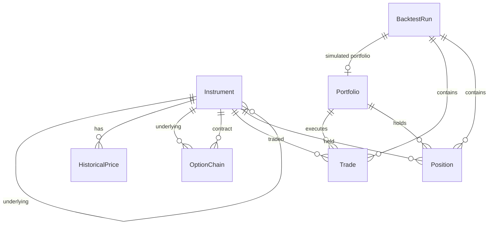
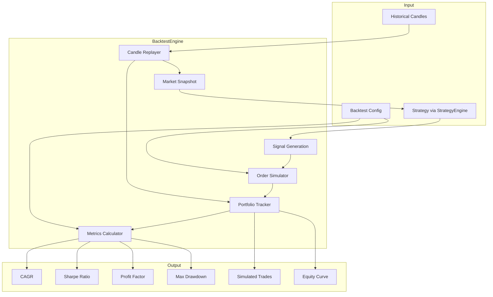

# AlgoTrader Architecture

## Tech Stack

Frontend:
- React
- Vite
- TypeScript

Backend:
- Node.js
- TypeScript
- Fastify

Database:
- PostgreSQL

Queue:
- Redis
- BullMQ

Observability:
- Prometheus
- Grafana

Deployment:
- Docker
- Docker Compose

---

## High Level Architecture

Market Data
      |
      v
Market Data Service
      |
      v
PostgreSQL
      |
      v
Strategy Engine
      |
      v
Backtest Engine
      |
      v
Portfolio Engine
      |
      v
Risk Engine
      |
      v
Broker Adapter
      |
      v
Execution

---

## Database Schema

Entity-relationship overview for the PostgreSQL data model (see `prisma/schema.prisma`).

| Model | Purpose |
|-------|---------|
| `Instrument` | Tradable symbols — indices, equities, futures, options |
| `HistoricalPrice` | OHLCV time-series bars for backtesting replay |
| `OptionChain` | Point-in-time option chain quotes per strike/side |
| `Portfolio` | Capital account (live, paper, or backtest) |
| `BacktestRun` | Strategy simulation run and performance metrics |
| `Trade` | Individual fills with brokerage, STT, slippage, and fees |
| `Position` | Open or closed holdings with PnL tracking |

---

## Modules

### Market Data

Responsibilities:

- Import historical data
- Import option chains
- Normalize data
- Store market snapshots

---

### Strategy Engine

Responsibilities:

- Evaluate market conditions
- Generate signals

Outputs:

- BUY
- SELL
- HOLD

Strategy interface:

interface Strategy {
  evaluate(snapshot): Signal
}

---

### Backtest Engine

Responsibilities:

- Replay historical data
- Simulate trades
- Calculate metrics

Outputs:

- CAGR
- Win Rate
- Drawdown
- Sharpe Ratio

Implementation: `src/backtest/` — `BacktestEngine` orchestrates replay, signal generation, order simulation, and portfolio tracking via dependency injection.

---

### Portfolio Engine

Responsibilities:

- Position tracking
- Margin tracking
- Capital allocation

---

### Risk Engine

Responsibilities:

- Validate trades
- Enforce position limits
- Calculate portfolio risk

---

### Broker Adapter

Interface:

interface Broker {
  placeOrder()
  cancelOrder()
  getPositions()
}

Implementations:

- PaperBroker
- ZerodhaBroker
- UpstoxBroker

---

## Folder Structure

src/

market-data/
strategies/
backtest/
portfolio/
risk/
broker/
analytics/
jobs/
api/

---

## Design Principles

- Modular
- Event Driven
- Testable
- Strategy Agnostic
- Broker Agnostic

No microservices until absolutely required.