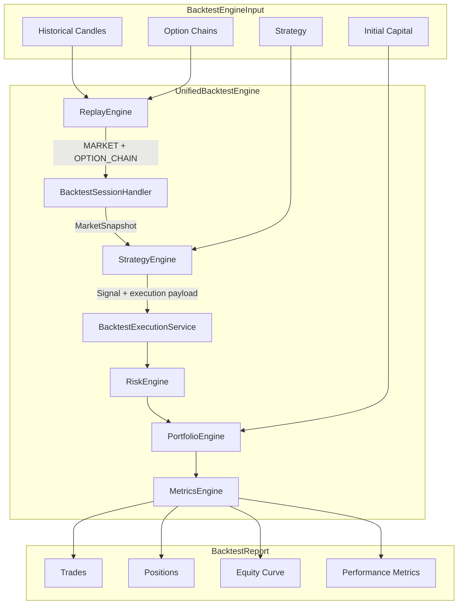
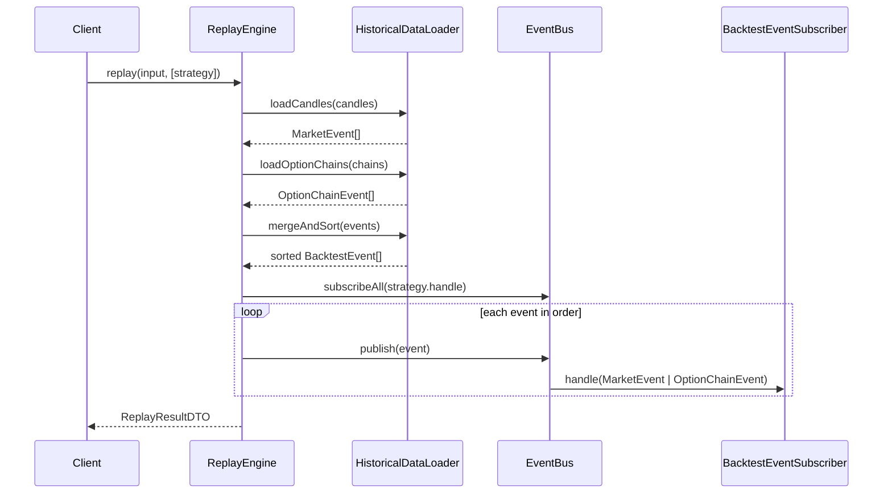

# Backtest Engine

Two backtest paths coexist:

| Engine | Use case |
|--------|----------|
| `UnifiedBacktestEngine` | Option strategies (bull put, iron condor, covered call) with historical candles + option chains |
| `CandleBacktestEngine` | Legacy equity-only candle backtests |

## Unified Architecture



Strategies attach an optional `execution` payload to each signal (`OPEN_DEFINED_RISK`, `CLOSE_DEFINED_RISK`, `OPEN_EQUITY`, `CLOSE_EQUITY`, `COMPOSITE`). The engine executes trades without strategy-specific logic — new strategies require zero engine changes.

## Usage

```typescript
import {
  createUnifiedBacktestEngine,
  createDefaultBacktestEngineDependencies,
  createReplayEngine,
  createInMemoryEventBus,
} from '../backtest/index.js';
import { createBullPutSpreadStrategy } from '../strategies/index.js';

const bus = createInMemoryEventBus();
const engine = createUnifiedBacktestEngine(
  createDefaultBacktestEngineDependencies(createReplayEngine(bus), bus),
);

const report = engine.run({
  config: {
    instrumentId: 'inst-nifty',
    symbol: 'NIFTY',
    initialCapital: 500_000,
    startDate: new Date('2024-01-01'),
    endDate: new Date('2024-03-31'),
  },
  strategy: createBullPutSpreadStrategy(),
  candles: [...],
  optionChains: [...],
});
```

---

# Event Replay Engine

Historical backtesting replays market data as a chronological stream of typed events published through an `EventBus`. Strategies subscribe to events without coupling to data loading or broker implementations.

## Architecture

```mermaid
flowchart TB
    subgraph Input["Historical Input"]
        Candles[BacktestCandle[]]
        Chains[HistoricalOptionChainDTO[]]
    end

    subgraph Engine["src/backtest/engine"]
        Loader[HistoricalDataLoaderService]
        Replay[ReplayEngine]
        Bus[EventBus]
    end

    subgraph Events["Typed Events"]
        ME[MarketEvent]
        OCE[OptionChainEvent]
        SE[SignalEvent]
        OFE[OrderFilledEvent]
        POE[PositionOpenedEvent]
        PCE[PositionClosedEvent]
    end

    subgraph Consumers["Subscribers (future)"]
        Strategy[Strategy Handler]
        Simulator[Portfolio Simulator]
        Metrics[Metrics Calculator]
    end

    Candles --> Loader
    Chains --> Loader
    Loader -->|merge + sort| Replay
    Replay -->|publish| Bus
    Bus --> ME
    Bus --> OCE
    Loader --> ME
    Loader --> OCE
    Bus -.->|downstream| SE
    Bus -.->|downstream| OFE
    Bus -.->|downstream| POE
    Bus -.->|downstream| PCE
    Bus --> Strategy
    Bus --> Simulator
    Bus --> Metrics
```

## Sequence Diagram



## Event Types

| Event | Source | Purpose |
|-------|--------|---------|
| `MarketEvent` | Historical candles | OHLCV bar for an instrument |
| `OptionChainEvent` | Historical option chains | Strike quotes at a point in time |
| `SignalEvent` | Strategy engine (downstream) | BUY / SELL / HOLD decision |
| `OrderFilledEvent` | Order simulator (downstream) | Simulated fill with price and quantity |
| `PositionOpenedEvent` | Portfolio simulator (downstream) | New position opened |
| `PositionClosedEvent` | Portfolio simulator (downstream) | Position closed with realized PnL |

Historical replay publishes only `MarketEvent` and `OptionChainEvent`. Simulation layers publish the remaining types through the same bus.

## Sorting Rules

Events are sorted by `timestamp` ascending. When timestamps tie, order is:

1. `MARKET`
2. `OPTION_CHAIN`
3. `SIGNAL`
4. `ORDER_FILLED`
5. `POSITION_OPENED`
6. `POSITION_CLOSED`

This ensures price context arrives before option chain data at the same bar.

## Usage

```typescript
import {
  createInMemoryEventBus,
  createReplayEngine,
  BacktestEventType,
} from '../backtest/engine/index.js';

const bus = createInMemoryEventBus();
const replayEngine = createReplayEngine(bus);

const result = replayEngine.replay(
  {
    instrumentId: 'inst-nifty',
    symbol: 'NIFTY',
    candles: [...],
    optionChains: [...],
  },
  [
    {
      name: 'bull-put-spread',
      handle(event) {
        if (event.type === BacktestEventType.OPTION_CHAIN) {
          // evaluate strategy
        }
      },
    },
  ],
);
```

## Legacy Compatibility

Pre-combined `MarketEvent` objects (with embedded `optionChain`) are supported via:

- `fromLegacyMarketEvents()` — split into typed events
- `toLegacyMarketEvents()` — merge for existing pipeline consumers
- `EventReplayEngine` in `src/backtest/replay/` delegates to the loader + adapter

## Design Principles

- **Event driven** — no direct loops in strategy code; subscribe via `EventBus`
- **Testable** — inject `EventBus`, pass in-memory candles/chains
- **Strategy agnostic** — `BacktestEventSubscriber` interface, no strategy imports
- **Broker agnostic** — historical replay only; no live execution
