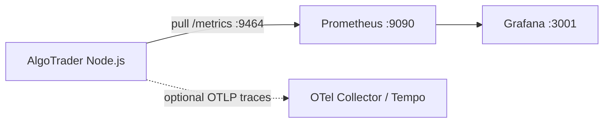

# Observability Stack

OpenTelemetry instrumentation for AlgoTrader with Prometheus metrics export.

## Architecture



## Metrics (Prometheus)

Business metrics are exported via **`prom-client`** at **`GET /metrics`** on the application port (3000).

See `src/observability/metrics/README.md` for the full metric catalog and Grafana query examples.

| Metric | Type |
|--------|------|
| `backtest_duration_seconds` | histogram |
| `backtest_runs_total` | counter |
| `strategy_signals_generated_total` | counter |
| `strategy_errors_total` | counter |
| `orders_executed_total` | counter |
| `positions_opened_total` | counter |
| `portfolio_value` | gauge |
| `drawdown_percentage` | gauge |

Prometheus endpoint: `http://localhost:3000/metrics`

## Traces

Auto-instrumented:

- HTTP (incoming via `@opentelemetry/instrumentation-http`)
- Fastify routes (via official `@fastify/otel` plugin)
- Prisma database queries (via `@prisma/instrumentation`)

Custom spans:

- `backtest.run`
- `strategy.evaluate`

Optional OTLP export via `OTEL_EXPORTER_OTLP_TRACES_ENDPOINT`.

## Local Development

```bash
# Start infra including Prometheus + Grafana
docker compose up -d

# Run app with OpenTelemetry pre-load
npm run dev
```

- App API: http://localhost:3000
- Metrics: http://localhost:9464/metrics
- Prometheus: http://localhost:9090
- Grafana: http://localhost:3001 (admin / admin)

## Environment Variables

See `.env.example` for `OBSERVABILITY_ENABLED`, `METRICS_PORT`, `OTEL_SERVICE_NAME`, and OTLP settings.

Tests disable observability via `tests/setup/otel-disable.ts`.

## Best Practices Applied

- Pre-load instrumentation via `--import` before application modules
- Separate metrics port from application port
- No-op services when disabled (tests, local scripts)
- Semantic attributes (`strategy.name`, `instrument.id`, `db.operation`)
- Graceful SDK shutdown on SIGTERM/SIGINT
- Pull-based Prometheus export (no push gateway required)
